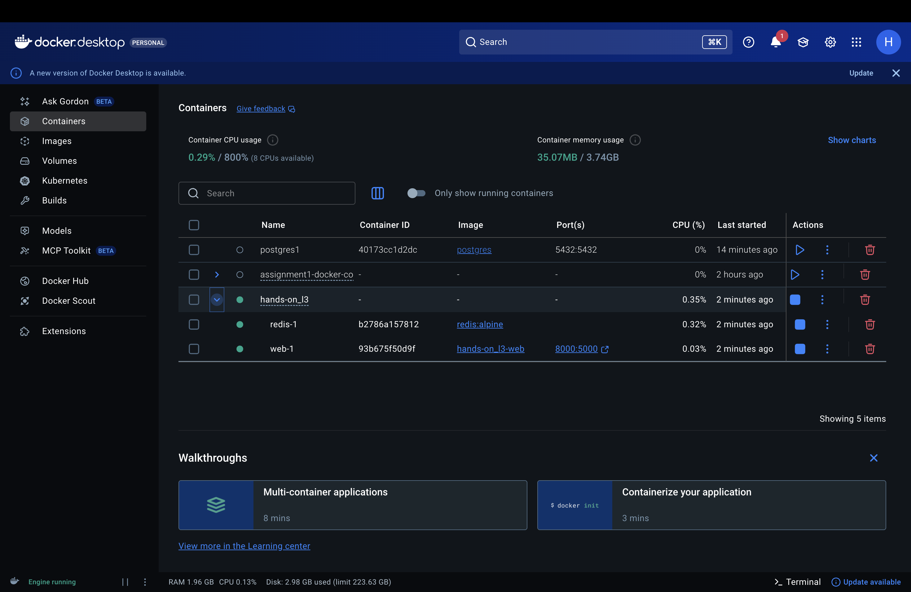
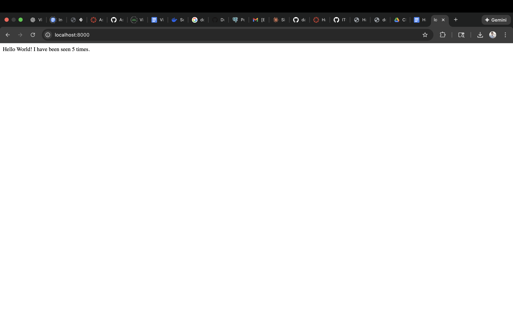
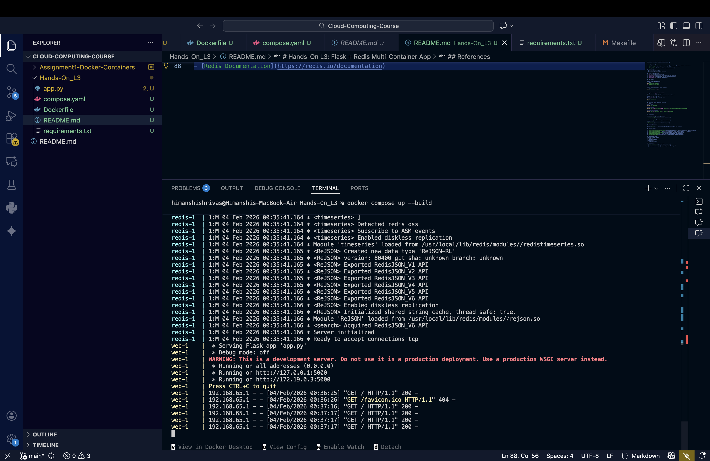

# Hands-On L3: Flask + Redis Multi-Container App

## Project Description
This project demonstrates a multi-container application using Docker Compose. It includes:
- **Flask web application** - Serves a simple page with visit counter
- **Redis cache** - Stores the visit count
- **PostgreSQL** - Practice container (separate exercise)

## Prerequisites
- Docker Desktop installed
- Basic terminal/command line knowledge

## Files in This Project
- `app.py` - Flask application code
- `Dockerfile` - Instructions to build the web app container
- `compose.yaml` - Orchestrates web app and Redis containers
- `requirements.txt` - Python dependencies

## How to Run

### 1. Clone the repository
```bash
git clone <your-repo-url>
cd HandsOn-L3-Flask-Redis
```

### 2. Build and run with Docker Compose
```bash
docker compose up --build
```

### 3. Open in browser
Navigate to: `http://localhost:8000`

You should see: "Hello World! I have been seen X times."

### 4. Stop the application
Press `Ctrl+C` in the terminal, then:
```bash
docker compose down
```

## PostgreSQL Setup (Separate Exercise)
```bash
# Pull image
docker pull postgres

# Run container
docker run -d -p 5432:5432 --name postgres1 -e POSTGRES_PASSWORD=pass12345 postgres

# Connect to PostgreSQL
docker exec -it postgres1 psql -d postgres -U postgres
```

## Screenshots

### Docker Desktop - Running Containers


### Application Output in Browser


### Terminal Logs


## Issues Encountered

See the [Issues](../../issues) tab for detailed error logs and solutions.

## What I Learned

1. **Multi-container orchestration** - Docker Compose makes it easy to run multiple services together
2. **Container networking** - Services can communicate using service names (e.g., 'redis')
3. **Environment configuration** - Using environment variables in Dockerfiles
4. **Debugging containers** - Using logs and exec commands to troubleshoot
5. **GitHub workflow** - Version control, issue tracking, and documentation

## Technologies Used
- Docker & Docker Compose
- Python 3.7
- Flask web framework
- Redis cache
- PostgreSQL database

## References
- [Docker Documentation](https://docs.docker.com/)
- [Flask Documentation](https://flask.palletsprojects.com/)
- [Redis Documentation](https://redis.io/documentation)